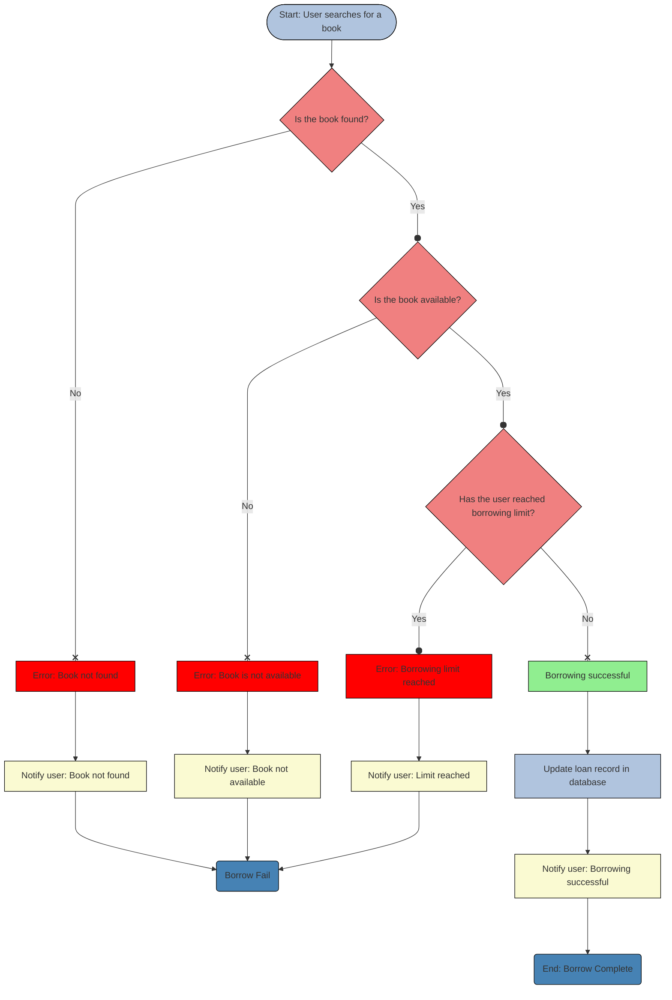
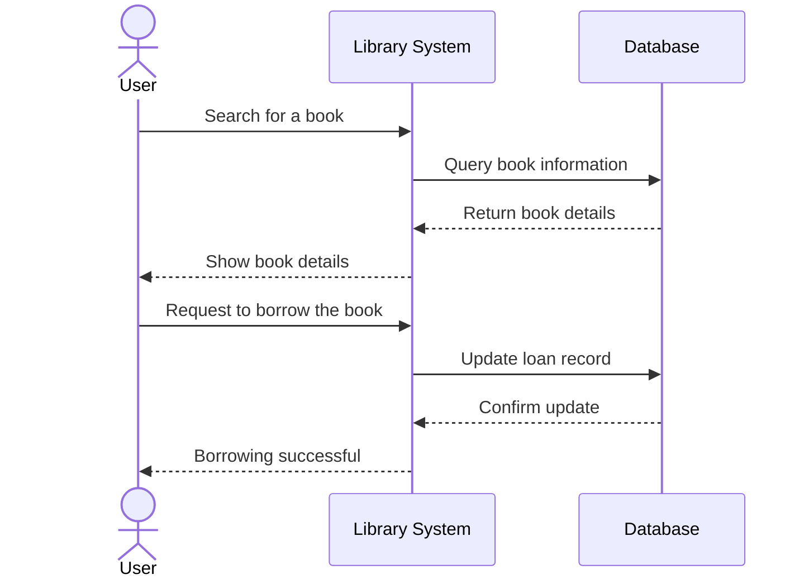
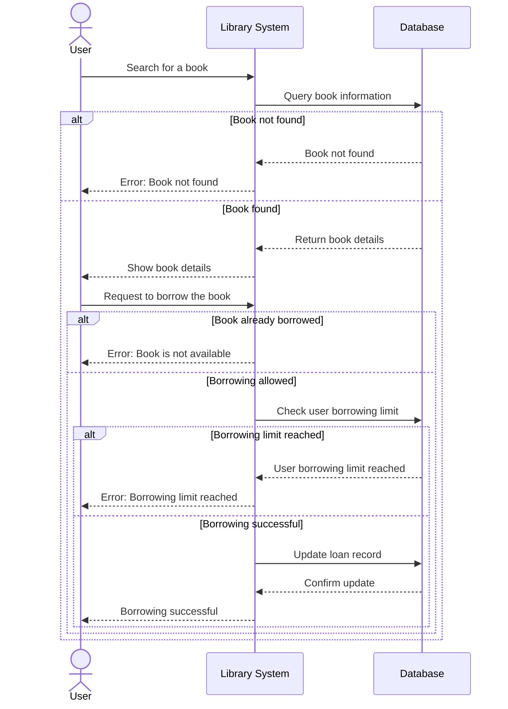
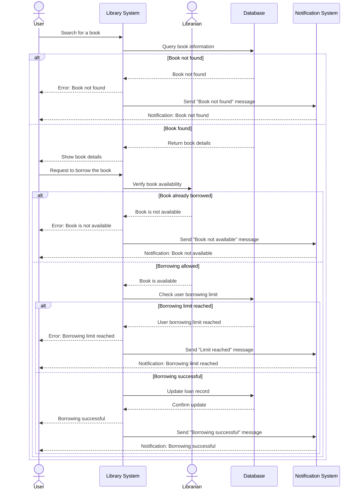

# A Library Brorrowing System Process (Including a simple Flowchart & Sequence Diagrams)

> For the Lesson 2 Lab Assignment for the Mermaid Diagrams, I chose the Choose Your Own Adventure scenario. I originally wanted to do the sequence diagram, but I need a flowchart to help me make the sequence diagram easier, so I'm including a simple flowchart here as well.

## Flowchart
### Library Borrowing System Process Description
The library borrowing system facilitates the process of searching for and borrowing books in a structured and user-friendly manner. Below is an overview of the workflow:

1. Start Search:
	* The user initiates the process by searching for a specific book through the library system.
2. Book Availability Check:
	* The system queries the database to determine if the book exists.
	* If the book is not found, the user is notified with an error message, and they are prompted to restart the search process.
3. Borrowing Eligibility:
	* If the book exists, the system checks whether it is currently available for borrowing.
	* If the book is unavailable (e.g., already borrowed), the user receives a notification indicating its unavailability.
4. Borrowing Limit Check:
	* If the book is available, the system verifies if the user has reached their borrowing limit.
	* If the limit is reached, the user is notified, and the process ends without completing the borrowing request.
5. Successful Borrowing:
	* If the user has not reached their borrowing limit, the system updates the loan record in the database to mark the book as borrowed.
	* The user is then notified of the successful borrowing transaction.
6. End Process:
	* The process concludes, either with a successful borrowing or with appropriate notifications in case of errors or restrictions.

## Sequence Diagram 
> **Note:** I include three diagrams here just to show my working process from an initial and simple sequence diagram to a complex and comprehensive sequence diagram.

### I. Basic Version of Library System Borrowing Process
1. Participants:
    * **User**
    * **Library System**
    * **Database**

2. Process:
    1. User searches for a book.

    2. The library system retrieves the book from the database.

    3. Database return the book details.

    4. User request to borrow the book.

    5. The library system update the borrowing history.

* Explanation:
    1. **User**: Interaction with the library system

    2. **Library System**: Handling the request and interacting with the database

    3. **Database**: Storing all book information and borrowing information

***
### II. Adding 3 Circumstances to the Sequence Diagram

* Circumstances (Exceptions):
    1. **Book is not available for borrowing**: if a book is already borrowed or under maintenance, the system will return "Book is not available".

    2. **Book not found**: if a book does not exist in the database, the system will return "Book not found".

    3. **The borrowing quantity of books reaches limit**: when a user reaches his books limit, the system will return "Borrowing limit reached".

***
### III. **Final Version**: Adding 2 more participants to make the diagram more comprehensive.

* Adding: 
    1. **Librarian**: When a user initiates a book borrowing request, Librarian needs to verify the status of the book and assist in completing the borrowing.

    2. **Notification System**: The notification system is responsible for sending notifications to users when a book is successfully borrowed or when an error occurs.

